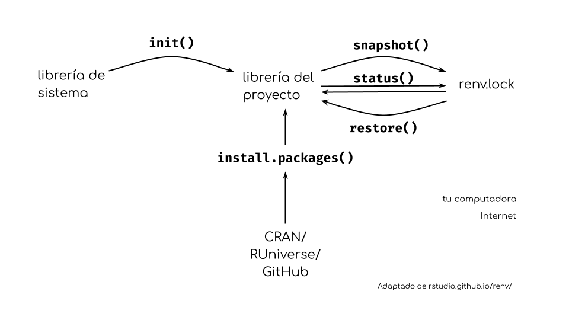

# renv

## Flujo de trabajo con renv 




## ✏️ Empezá a usar renv

1. Crea un nuevo proyecto y añade un nuevo documento Quarto (puedes guardarlo como `analisis.qmd`).

2. En la consola, ejecutá `renv::init()`.

3. Ejecutá `renv::status()`.

## ✏️ Usa ggplot2

1. . Añadí un nuevo bloque de código que cargue ggplot2 con `library(ggplot2)` en `analisis.qmd`.

2. Intenta renderizar el archivo.


## ✏️ Instalá ggplot2

1. Instalá ggplot2 con el comando `install.packages("ggplot2")`en la consola.

2. Renderizá el archivo`analisis.qmd`.

3. Ejecutá `renv::status()` en la consola.


## ✏️ Actualiza el archivo `renv.lock`


2. Ejecutá `renv::snapshot()` en la consola.

3. Verás una lista de paquetes y el texto 

```¿Quieres continuar? [Y/N]: 
``` 

Escribe y, luego apretá enter.

4. Ejecuta `renv::status()` en la consola.


## ✏️ Restaurar un entorno de trabajo

1. Descargá este [proyecto reproducible](/static/proyecto_reproducible.zip).

3. Abrí el proyecto y ejecuta`renv::status()`en la consola de R. ¿Cuál es el estado de los paquetes?

4. Ejecuta`renv::restore()`en la consola de R y continúa.

5. Ejecutá de nuevo`renv::status()`para comprobar que el proyecto está en un estado coherente.

6. Generá `analisis/reporte.Rmd`para asegurarte de que ha funcionado.

## Tips {background-color="#6e3667"}

::: {.incremental}

* El archivo `renv.lock`
* Detección de dependencias
* Instalación de paquetes
* Dependencias del sistema

:::

## Gracias! {background-color="#6e3667"}

::: {.incremental}

* El material de este taller vive en [paocorrales.github.io/intro-renv/](https://paocorrales.github.io/intro-renv/)

  * Licencia CC-BY-SA (usalo como quieras pero siempre con la misma licencia!)
  * Y contame :)
  * Mi mail: paola.corrales@anu.edu

* Otros recursos: [Documentación del paquete renv](https://rstudio.github.io/renv/index.html)
  * [Cómo empezar](https://rstudio.github.io/renv/articles/renv.html)
  * [Preguntas frecuentes](https://rstudio.github.io/renv/articles/faq.html)
:::


